# Plan

```mermaid
graph TD
   A[BlenderGig🔥] --> B[HarukaLyumaVket2024🔥]
   B --> E[CICDXRUnitTest🔥]
   E --> F[ServerBackend🚫]
   F --> G[IK🚫]
   G --> H[Speech🚫]
   H --> K[DESKTOP_ControllerPlayPS5🚫]
   K --> L[VR_SteamVR🚫]
   L --> J[Upload]
   J --> N[PlaceholderAvatar]
   N --> Q[VroidHub🚫]
   Q --> O[PlaceholderWorld]
   O --> Y[CCBYHome🚫]
```

```mermaid
graph TD
   subgraph CompletedTasks
       M[PR_GodotSceneToJsonTranslator✅]
       R[VroidHub✅]
       V[ClothingTransferSkeletonMerge✅]
   end
```

## Operations on the Directed Acyclic Graph (DAG)

The original graph was a Directed Acyclic Graph (DAG) where each node could have multiple children. The operations performed on this DAG were aimed at transforming it into a Left-child right-sibling binary tree. Here's a description of the operations:

1. **Identifying the First Child:** For each node in the original DAG, we identified the first child node. This is the left-most child in the original diagram.

2. **Identifying Siblings:** For each first child identified in step 1, we then identified its siblings. These are the nodes that share the same parent as the first child.

3. **Creating Binary Tree:** We created a new binary tree where each node has at most two children: the left child is the first child from the original diagram, and the right child is the next sibling of the left child.

4. **Pushing Nodes Marked with 😴:** Nodes marked with 😴 were pushed to the end of their respective branches in the binary tree. This means they became the rightmost child of their respective parent nodes.

5. **Preserving Order:** The order of the nodes in the binary tree follows the order of the nodes in the original DAG, except for the nodes marked with 😴 which were pushed later into the tree.

The resulting binary tree maintains the directed acyclic property of the original DAG, but now each node has at most two children, making it easier to traverse and manage.
