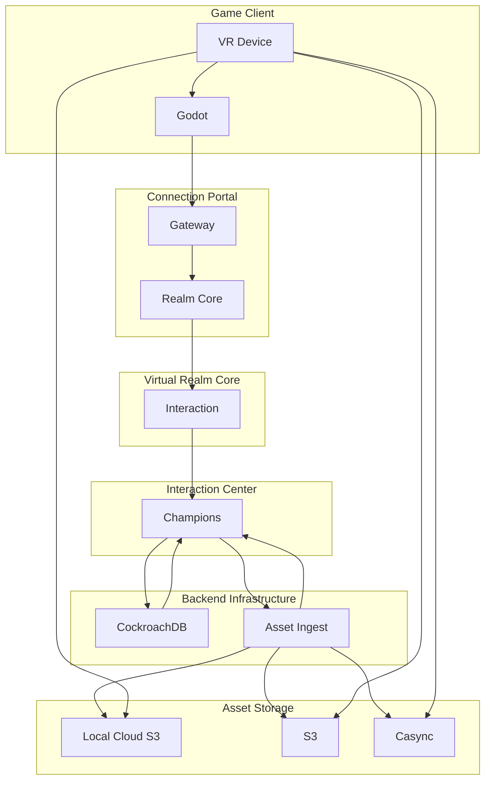

## Prototype 0: Push an asset to a service

### Input

1. Input godot text scene or godot binary scene.

### Data Structures

- An Elixir struct representing Godot Scene.
- An Elixir struct represents the list of validations for 3D modeling and animation.

#### Godot Scene

1. Reconstructs a virtual tree from a flat array of nodes to prevent node paths from breaking out of the scene.
2. Strips resources like gdscripts in the packed scene using a whitelist.

#### Node3D Validations

1. **Validate Node3D Naming Suffix**: Confirm that the naming suffix for Node3D is correct.
2. **Validate No Node3D Transforms**: Check that there are no null or empty Node3D transforms in the model.
3. **Validate Unique Names**: Verify that all names in the Node3D are unique.

#### Colliders Validations

1. **Validate Collider Shape**: Ensure that each collider has a valid shape assigned.
2. **Validate Collider Position**: Check that each collider's position is within the expected range.
3. **Validate Collider Size**: Confirm that each collider's size is within the expected range.

#### Skeleton Validations

1. **Validate Skeleton Bones**: Ensure that each bone in the skeleton is connected to at least one other bone.
2. **Validate Skeleton Bind Pose**: Check that the bind pose of the skeleton is correctly defined.
3. **Validate Skeleton Weight Painting**: Confirm that the weight painting of the skeleton is correctly done.

### Output

1. Output Godot Scene

Before the game client/server architecture is sound, we need to be able to push an asset to a service with sanitization and validation. This service will separate the Node3D, colliders, and skeletons. Then, the game server pulls those elements in.
