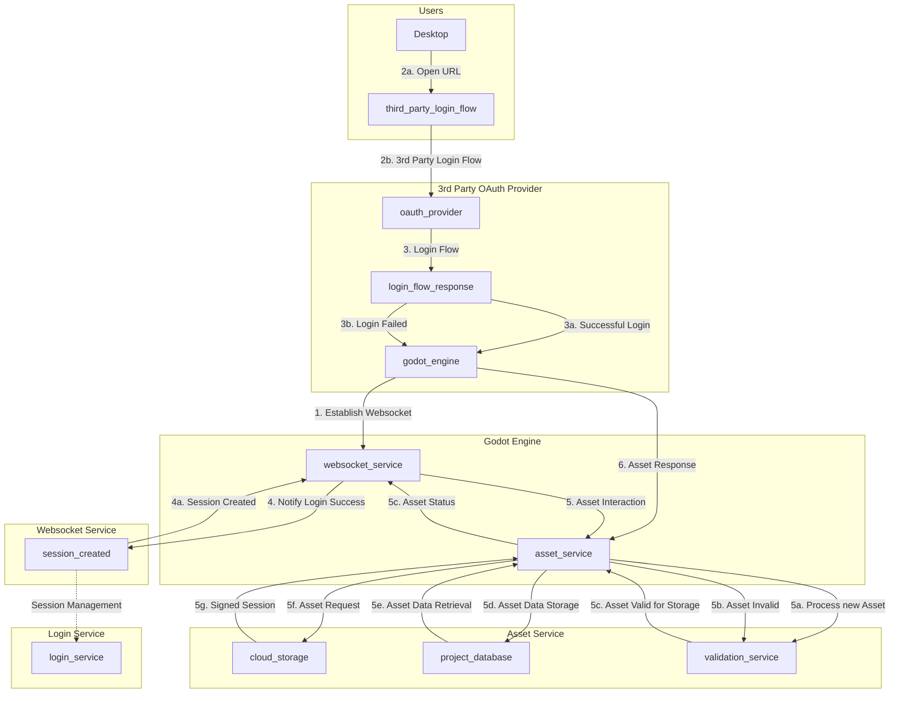

# V-Sekai Other World Architecture: Overview

The V-Sekai Other World Architecture project aims to create a virtual world using the binary Godot Engine client and server. The development process is divided into several prototypes, each with its own specific goals and objectives.

> **Note:** Instead of working on a car engine, work on the body. Instead of a bicycle wheel, work on the frame.

## Prototype 1: Element Instantiation and Uploading

In this prototype, we will instantiate elements into our virtual world and pull them for user interaction. These elements include:

1. **Colliders**: Invisible objects that simulate solid matter.
2. **Per Bone Capsules**: Simplified user avatars used for collision detection.

## Prototype 2: Packaging, Marker3D, and Quad Plane

This prototype involves packaging colliders and per bone capsules for upload/download. We will introduce a Marker3D at coordinates (0, 0, 1) as a reference point in the 3D space. Additionally, we will add a quad plane to our virtual world, which will serve as a basic surface or platform within the environment.

## Prototype 3: Tree Concept Decision and Texture Packaging

During this prototype, we will decide between the GLTF2 concept of a unified node tree or the Godot Engine / Blender concept of armatures. Textures, materials, meshes, and IDs will be packaged at the marker.

## Prototype 4: Object Uploads and Positioning

In this prototype, we will develop the capability to upload objects like a teacup (possibly a collider) and an avatar. Users will be able to drag and scale these objects.

- name
- user_uid
- attachments
  - avatar (materials, meshes, animations)
  - colliders
- scale
- skeleton

## Prototype 5: Server Management and Scripting

This prototype will focus on server management considerations such as handling server downtime and managing user logouts/logins. We will also incorporate scripting into the system.

## Prototype 6: Physics

This prototype will involve the implementation of physics in our virtual world.

## Prototype 7: Server Capacity and Bandwidth Limit

In this final prototype, we will ensure that the server can handle up to 100 people per instance. We will also calculate the bandwidth and object/mesh complexity limit.

The estimated timeline for this project is between 2 to 4 weeks.
