# project-other-world

<!-- ALL-CONTRIBUTORS-BADGE:START - Do not remove or modify this section -->

<!-- ALL-CONTRIBUTORS-BADGE:END -->

The V-Sekai World project aims to create a virtual world using the Godot Engine client and server.

## Progress Milestones

```mermaid
flowchart LR
    CL{Client} -->|Interacts with| HP[Human Players]
    CL -->|Uses| OT["Open Telemetry<br>Experimental 🧪"]
    UX --> CL{Client}
    G4 -->|Used by| CL
    VR -->|Used by| CL
    BE -->|Loads Avatars 🚧| CL
    BE -->|Loads Worlds 🚧| CL
    SE -->|Downloads Avatars| CL
    SE -->|Downloads Worlds| CL
    VOIP -->|Used by| CL
    VRP -->|Interacts with| CL
    PR -->|Has| CL{Client}

    HP -->|Joins| BE
    BE -->|Interacts with| HP
    BE -->|Uploads Avatars 🧪| ED
    BE -->|Uploads Worlds 🧪| ED
    DB[SQLite & FoundationDB Alternative 🎯] -->|Used by| BE[Backend]

    SE{Server} -->|Uses| G4
    PR -->|Has| SE{Server}
    VOIP[Speech VOIP Addon 🧪] -->|Used by| SE

    G4["Godot 4.3 Release<br>Est. July 2024 🚧"] -->|Followed by| G0
    FB -->|Used by| G4
    AN -->|Used by| G4

    G0["Godot 4.0 Release<br>Done March 2023 🚀<br>Unified Godot Humanoid Skeleton 🚀"] -->|Releases| GE
    GF -->|Used by| G0

    GE((Godot Engine)) -->|Uses| PR[Project Other World]

    PR -->|Involves| CO[Contributors]
    PR -->|Uses| GE

    CO -->|Includes| SA[Saracen]
    CO -->|Includes| IF[iFire]
    CO -->|Includes| TO[Tokage]
    CO -->|Includes| LY[lyuma]
    CO -->|Includes| EW[EnthWyrr]
    CO -->|Includes| MM[MMMaellon]
    CO -->|Includes| SI[Silent]
    CO -->|Includes| BP[Bioblaze Payne]

    SA -->|Works on| UX["UI/UX Redesign"]
    IF -->|Works on| FB
    IF -->|Works on| BI
    IF -->|Works on| OT
    TO -->|Works on| AN
    LY -->|Works on| FB
    SI -->|Works on| UX

    VRM[VR Multiplayer 🧪] -->|3-4 Players| VRP[VR Players]
    VR -->|Depends on| GF
    VRM -->|Used by| ED

    ED{Editor} -->|Creates| UN["Unidot Unity Package Importer<br>Done March 2023 - May 2024 🚀"]
    ED -->|Creates| FB["FBX 🚧"]
    ED -->|Releases| GF["glTF2.0 general release<br>Concurrent with Godot 4.0 Release 🚀"]
    ED -->|Depends on| VRM["VRM 1.0<br>Depends on glTF2.0 general release 🚀"]
    CSG["Constructive Solid Geometry with Manifold 🚧"] -->|Used by| ED
    EM1["Experimental Mirrors: Engine Patch 🧪"] -->|Used by| ED
    EM2["Experimental Mirrors: Screenspace 🧪"] -->|Used by| ED
    RW["Resource Whitelister 🎯"] -->|Used by| ED
    BI["Built-in Blender Importer 🚀"] -->|Used by| ED
    MT["MeshTransform<br>Done by iFire & MarcusLoppe 🧪"] -->|Used by| ED[Editor]

    T3D["3D Mesh"] -->|Tokenized into| TSeq["Sequence of Tokens"]
    ED -->|Inputted into| TM["Transformer Model"]
    TSeq -->|Inputted into| TM
    TM -->|Generates| NM["New Meshes"]
    TM -->|Modifies| EM["Existing Meshes"]
```

- Experimental (🧪): This stage is for features that are still being tested and may not be stable.
- Feature complete (🎯): This stage is for features that have all planned functionality implemented.
- Beta (🚧): This stage is for features that are largely complete but may still have bugs.
- General release (🚀): This stage is for features that have been fully tested and are now released.

## Contributors ✨

Thanks goes to these wonderful people ([emoji key](https://allcontributors.org/docs/en/emoji-key)):

<!-- ALL-CONTRIBUTORS-LIST:START - Do not remove or modify this section -->
<!-- prettier-ignore-start -->
<!-- markdownlint-disable -->
<table>
  <tbody>
    <tr>
      <td align="center" valign="top" width="14.28%"><a href="https://github.com/SaracenOne"> <b>Saracen</b></a> <a href="https://github.com/V-Sekai/v-sekai-other-world/commits?author=SaracenOne" title="Code">💻</a> <a href="#design-SaracenOne" title="Design">🎨</a> <a href="#ideas-SaracenOne" title="Ideas, Planning, & Feedback">🤔</a></td>
      <td align="center" valign="top" width="14.28%"><a href="https://chibifire.com"> <b>K. S. Ernest (iFire) Lee</b></a> <a href="https://github.com/V-Sekai/v-sekai-other-world/commits?author=fire" title="Code">💻</a> <a href="#design-fire" title="Design">🎨</a> <a href="#research-fire" title="Research">🔬</a> <a href="#ideas-fire" title="Ideas, Planning, & Feedback">🤔</a> <a href="#infra-fire" title="Infrastructure (Hosting, Build-Tools, etc)">🚇</a></td>
      <td align="center" valign="top" width="14.28%"><a href="http://tokage.info/lab"> <b>Silc Lizard (Tokage) Renew</b></a> <a href="#design-TokageItLab" title="Design">🎨</a> <a href="https://github.com/V-Sekai/v-sekai-other-world/commits?author=TokageItLab" title="Code">💻</a></td>
      <td align="center" valign="top" width="14.28%"><a href="https://github.com/lyuma"> <b>lyuma</b></a> <a href="https://github.com/V-Sekai/v-sekai-other-world/commits?author=lyuma" title="Code">💻</a> <a href="#infra-lyuma" title="Infrastructure (Hosting, Build-Tools, etc)">🚇</a></td>
      <td align="center" valign="top" width="14.28%"><a href="https://github.com/EnthWyrr"> <b>EnthWyrr</b></a> <a href="#translation-EnthWyrr" title="Translation">🌍</a></td>
      <td align="center" valign="top" width="14.28%"><a href="https://github.com/MMMaellon"> <b>MMMaellon</b></a> <a href="https://github.com/V-Sekai/v-sekai-other-world/commits?author=MMMaellon" title="Code">💻</a> <a href="#design-MMMaellon" title="Design">🎨</a></td>
      <td align="center" valign="top" width="14.28%"><a href="http://s-ilent.gitlab.io/"> <b>Silent</b></a> <a href="#design-s-ilent" title="Design">🎨</a> <a href="#ideas-s-ilent" title="Ideas, Planning, & Feedback">🤔</a></td>
    </tr>
    <tr>
      <td align="center" valign="top" width="14.28%"><a href="https://www.linkedin.com/in/mraarseth"> <b>Bioblaze Payne</b></a> <a href="https://github.com/V-Sekai/v-sekai-other-world/commits?author=Bioblaze" title="Code">💻</a> <a href="#ideas-Bioblaze" title="Ideas, Planning, & Feedback">🤔</a></td>
    </tr>
  </tbody>
</table>

<!-- markdownlint-restore -->
<!-- prettier-ignore-end -->

<!-- ALL-CONTRIBUTORS-LIST:END -->

This project follows the [all-contributors](https://github.com/all-contributors/all-contributors) specification. Contributions of any kind welcome!
