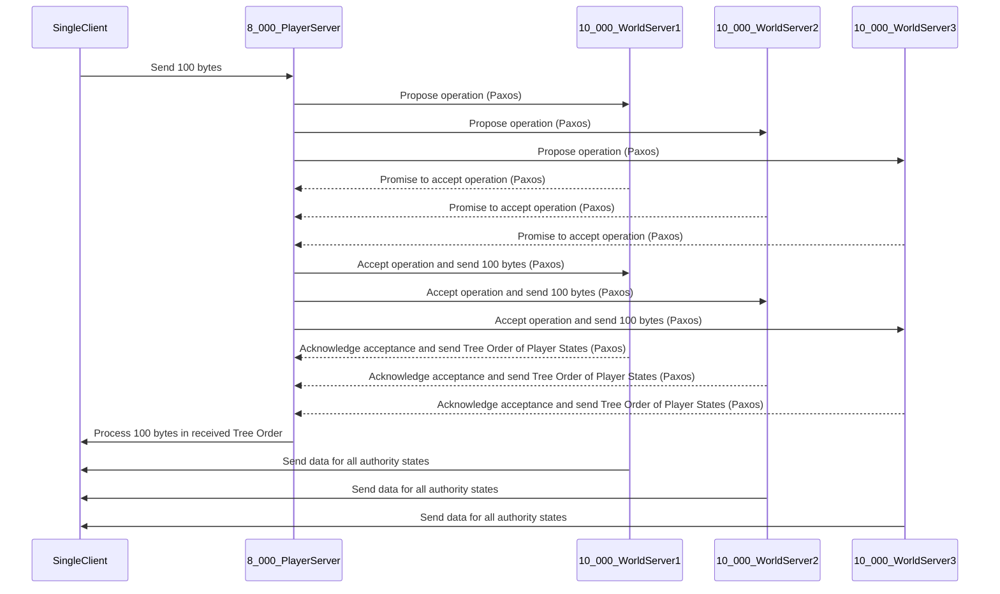

To calculate the operations per second (ops/s) needed, we need to consider the number of players and the frequency at which each operation is performed.

1. For isolated player state nodes:

   - 8,000 players are handled at a frequency of 100hz. This means that each player is processed 100 times per second.
   - Therefore, the ops/s = 8,000 players \* 100 operations/player/second = 800,000 ops/s.

2. For individual player state processing:

   - Similarly, 8,000 players are handled at a frequency of 100hz.
   - Therefore, the ops/s = 8,000 players \* 100 operations/player/second = 800,000 ops/s.

3. For storing all player states in a history buffer:
   - 10,000 players are handled at a frequency of 100hz for 1 second.
   - Therefore, the ops/s = 10,000 players \* 100 operations/player/second = 1,000,000 ops/s.

So, if you want to run your production systems at 40% capacity at all times, as suggested in the article you linked, you would need a system capable of handling:

- For isolated player state nodes and individual player state processing: 800,000 ops/s / 0.4 = 2,000,000 ops/s.
- For storing all player states in a history buffer: 1,000,000 ops/s / 0.4 = 2,500,000 ops/s.

These calculations assume that each operation takes the same amount of time, which might not be the case in a real-world scenario. Also, keep in mind that these numbers represent the theoretical maximum capacity needed. The actual capacity required could be lower depending on the efficiency of your code and the specific workload characteristics.

