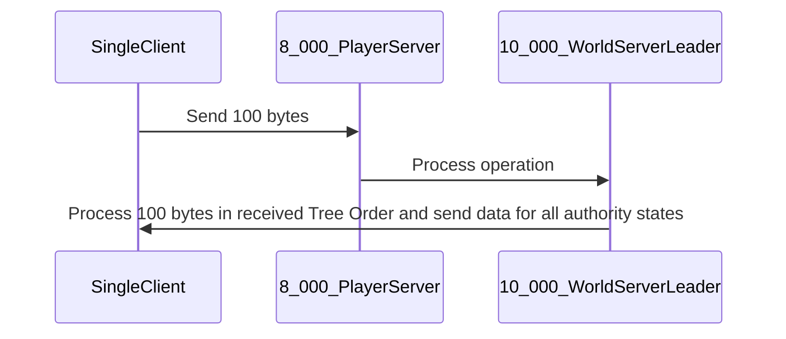
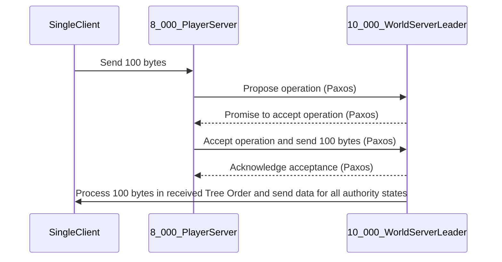

To calculate the operations per second (ops/s) needed, we need to consider the number of players and the frequency at which each operation is performed.

1. For isolated player state nodes:

   - 8,000 players are handled at a frequency of 100hz. This means that each player is processed 100 times per second.
   - Therefore, the ops/s = 8,000 players \* 100 operations/player/second = 800,000 ops/s.

2. For individual player state processing:

   - Similarly, 8,000 players are handled at a frequency of 100hz.
   - Therefore, the ops/s = 8,000 players \* 100 operations/player/second = 800,000 ops/s.

3. For storing all player states in a history buffer:
   - 10,000 players are handled at a frequency of 100hz for 1 second.
   - Therefore, the ops/s = 10,000 players \* 100 operations/player/second = 1,000,000 ops/s.

So, if you want to run your production systems at 40% capacity at all times, as suggested in the article you linked, you would need a system capable of handling:

- For isolated player state nodes and individual player state processing: 800,000 ops/s / 0.4 = 2,000,000 ops/s.
- For storing all player states in a history buffer: 1,000,000 ops/s / 0.4 = 2,500,000 ops/s.

These calculations assume that each operation takes the same amount of time, which might not be the case in a real-world scenario. Also, keep in mind that these numbers represent the theoretical maximum capacity needed. The actual capacity required could be lower depending on the efficiency of your code and the specific workload characteristics.

1. **UDP Monitor and Forwarder (8_000_PlayerServer to 10_000_WorldServerLeader)**:

This program would monitor incoming packets at the 8_000_PlayerServer. When it receives the packet from the SingleClient, it forwards this data to another IP:port for 10_000_WorldServerLeader. It also needs to inform the 10_000_WorldServerLeader about the original source IP:port (SingleClient) for spoofing.

2. **UDP Responder (10_000_WorldServerLeader to SingleClient)**:

- It processes the operation received from the `8_000_PlayerServer`.
- It collects all the ring buffer states.
- Retrieve the states from the BPF map. The BPF map is a key-value store data structure that can be accessed from both the eBPF program and a user space application.
- On write send back the processed data to the `SingleClient` by spoofing the source IP:port as informed by the first program.

3. **Iterator and Interpolator (10_000_WorldServerLeader)**:

- It retrieves the player states from the BPF map. The BPF map is a key-value store data structure that can be accessed from both the eBPF program and a user space application.
- Sort the retrieved states using a Left-child right-sibling binary tree to represent a tree with an arbitrary number of children per node.
- It uses an iterator to traverse through the player states. In eBPF, you can use `bpf_map_get_next_key` to iterate over the keys in a map.
- The interpolation process depends on the specific algorithm you're using. If possible, choose an interpolation method that has a lower time complexity.

### Paxos sequence

### Other references

https://github.com/iovisor/ubpf/
