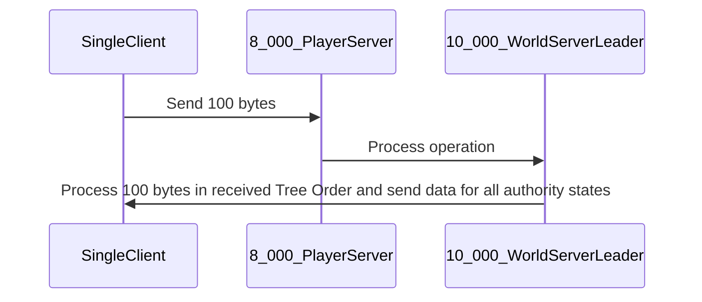
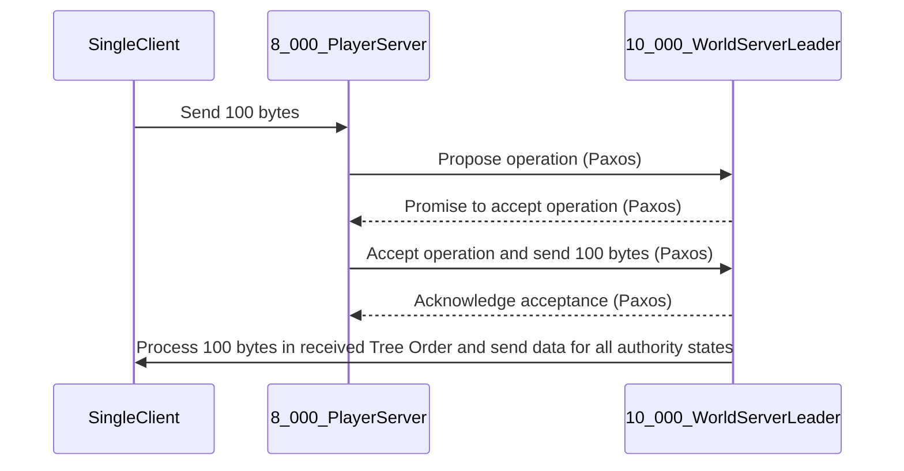

To calculate the operations per second (ops/s), consider the number of players and the frequency of each operation.

1. **Isolated Player State Nodes & Individual Player State Processing**:

   - 8,000 players are processed at a frequency of 100hz.
   - Therefore, the ops/s = 8,000 players \* 100 operations/player/second = 800,000 ops/s.

2. **Storing All Player States in a History Buffer**:

   - 10,000 players are processed at a frequency of 100hz for 1 second.
   - Therefore, the ops/s = 10,000 players \* 100 operations/player/second = 1,000,000 ops/s.

To run your production systems at 40% capacity, you would need a system capable of handling:

- For isolated player state nodes and individual player state processing: 800,000 ops/s / 0.4 = 2,000,000 ops/s.
- For storing all player states in a history buffer: 1,000,000 ops/s / 0.4 = 2,500,000 ops/s.

These calculations assume that each operation takes the same amount of time, which might not be the case in a real-world scenario. Also, these numbers represent the theoretical maximum capacity needed. The actual capacity required could be lower depending on the efficiency of your code and the specific workload characteristics.



1. **UDP Monitor and Forwarder (8_000_PlayerServer to 10_000_WorldServerLeader)**:

This program monitors incoming packets at the 8_000_PlayerServer and forwards them to 10_000_WorldServerLeader, informing it about the original source IP:port (SingleClient) for spoofing.

2. **UDP Responder (10_000_WorldServerLeader to SingleClient)**:

- Processes the operation received from the `8_000_PlayerServer`.
- Collects all the ring buffer states.
- Retrieves the states from the BPF map.
- Sends back the processed data to the `SingleClient` by spoofing the source IP:port as informed by the first program.

3. **Iterator and Interpolator (10_000_WorldServerLeader)**:

- Retrieves the player states from the BPF map.
- Sorts the retrieved states using a Left-child right-sibling binary tree.
- Uses an iterator to traverse through the player states.
- Performs interpolation based on the specific algorithm used.

### Paxos sequence



### Other references

[ubpf](https://github.com/iovisor/ubpf/)

### Macos

```
brew install lima
lima --version
limactl version 0.16.0
mkdir -p ~/Desktop/epbf-mac-arm-tutorial
cd ~/Desktop/epbf-mac-arm-tutorial
```

```
cat <<EOF > ubuntu-lts-ebpf.yaml
images:
# Try to use release-yyyyMMdd image if available. Note that release-yyyyMMdd will be removed after several months.
- location: "https://cloud-images.ubuntu.com/releases/22.04/release-20230518/ubuntu-22.04-server-cloudimg-amd64.img"
  arch: "x86_64"
  digest: "sha256:afb820a9260217fd4c5c5aacfbca74aa7cd2418e830dc64ca2e0642b94aab161"
- location: "https://cloud-images.ubuntu.com/releases/22.04/release-20230518/ubuntu-22.04-server-cloudimg-arm64.img"
  arch: "aarch64"
  digest: "sha256:b47f8be40b5f91c37874817c3324a72cea1982a5fdad031d9b648c9623c3b4e2"
# Fallback to the latest release image.
- location: "https://cloud-images.ubuntu.com/releases/22.04/release/ubuntu-22.04-server-cloudimg-amd64.img"
  arch: "x86_64"
- location: "https://cloud-images.ubuntu.com/releases/22.04/release/ubuntu-22.04-server-cloudimg-arm64.img"
  arch: "aarch64"

memory: "2GiB"
cpus: 2
disk: "30GiB"
ssh:
  # You can choose any port or omit this. Specifying a value ensures same port bindings after restarts
  # Forwarded to port 22 of the guest.
  localPort: 2222
# We are going to install all the necessary packages for our development environment.
# These include Python 3 and the bpfcc tools package.
provision:
  - mode: system
    script: |
      #!/bin/bash
      set -eux -o pipefail
      export DEBIAN_FRONTEND=noninteractive
      apt update && apt-get install -y vim python3 bpfcc-tools linux-headers-$(uname -r)
  - mode: user
    script: |
      #!/bin/bash
      set -eux -o pipefail
      sudo cp /home/$(whoami).linux/.ssh/authorized_keys /root/.ssh/authorized_keys
EOF
```

```
limactl start --name=ebpf-lima-vm ./ubuntu-lts-ebpf.yaml
```

```
#!/usr/bin/python3
from bcc import BPF

program = r"""
int hello(void *ctx) {
    bpf_trace_printk("Hello Mac. I am an eBPF program!");
    return 0;
}
"""
b = BPF(text=program)
syscall = b.get_syscall_fnname("execve")
b.attach_kprobe(event=syscall, fn_name="hello")
b.trace_print()
```

```
limactl shell ebpf-lima-vm
```
